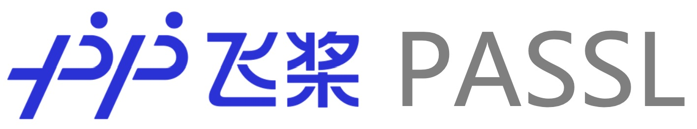

([简体中文](./README_cn.md)|English)

  

    
    
    

  
  <h5>
  <a href="#quick-start"> Quick Start </a>
  | <a href="#documents"> Documents </a>
  | <a href="#model-list"> Models List </a>
  </h5>

🚀📒🔎

## Introduction

PASSL is a Paddle based vision library for state-of-the-art Self-Supervised Learning research with [PaddlePaddle](https://www.paddlepaddle.org.cn/). PASSL aims to accelerate research cycle in self-supervised learning: from designing a new self-supervised task to evaluating the learned representations.

- **Reproducible implementation of SOTA in Self-Supervision**: Existing SOTA in Self-Supervision are implemented - [SimCLR](https://arxiv.org/abs/2002.05709), [MoCo(v1)](https://arxiv.org/abs/1911.05722), [MoCo(v2)](https://arxiv.org/abs/1911.05722), [MoCo-BYOL](docs/Train_MoCo-BYOL_model.md), [CLIP](https://arxiv.org/abs/2103.00020). [BYOL](https://arxiv.org/abs/2006.07733) is coming soon. Also supports supervised trainings.
- **Modular**: Easy to build new tasks and reuse the existing components from other tasks (Trainer, models and heads, data transforms, etc.).

Recent Update

## Implemented Models

* **Self-Supervised Learning Models **

|           | epochs | official results | passl results | Backbone  | Model                                                        | Tutorial                                         |
| --------- | ------ | ---------------- | ------------- | --------- | ------------------------------------------------------------ | ------------------------------------------------ |
| MoCo      | 200    | 60.6             | 60.64         | ResNet-50 | [download](https://passl.bj.bcebos.com/models/moco_v1_r50_e200_ckpt.pdparams) | [Train MoCo](docs/Train_MoCo_model.md)           |
| SimCLR    | 100    | 64.5             | 65.3          | ResNet-50 | [download](https://passl.bj.bcebos.com/models/simclr_r50_ep100_ckpt.pdparams) | [Train SimCLR](docs/Train_SimCLR_model.md)       |
| MoCo v2   | 200    | 67.7             | 67.72         | ResNet-50 | [download](https://passl.bj.bcebos.com/models/moco_v2_r50_e200_ckpt.pdparams) | [Train MoCo](docs/Train_MoCo_model.md)           |
| MoCo-BYOL | 300    | 71.56            | 72.10         | ResNet-50 | [download](https://passl.bj.bcebos.com/models/mocobyol_r50_ep300_ckpt.pdparams) | [Train MoCo-BYOL](docs/Train_MoCo-BYOL_model.md) |
| BYOL      | 300    | 72.50            | 71.62         | ResNet-50 | [download](https://passl.bj.bcebos.com/models/byol_r50_300.pdparams) | [Train BYOL](docs/Train_BYOL_model.md)           |
| PixPro    | 100    | 55.1(fp16)       | 57.2(fp32)    | ResNet-50 | [download](https://passl.bj.bcebos.com/models/pixpro_r50_ep100_no_instance_with_linear.pdparams) | [Train PixPro](docs/Train_PixPro_model.md)       |

> Benchmark Linear Image Classification on ImageNet-1K

* **Classification Models**

|                  | Detail | Tutorial                                                     |
| ---------------- | ------ | ------------------------------------------------------------ |
| ViT              |        | [PaddleEdu](https://aistudio.baidu.com/aistudio/projectdetail/2293050) |
| Swin Transformer |        | [PaddleEdu](https://aistudio.baidu.com/aistudio/projectdetail/2280436) |
| CaiT             |        | [PaddleFleet](https://aistudio.baidu.com/aistudio/projectdetail/3401469) |
| T2T-ViT          |        | [PaddleFleet](https://aistudio.baidu.com/aistudio/projectdetail/3401348) |
| CvT              |        | [PaddleFleet](https://aistudio.baidu.com/aistudio/projectdetail/3401386) |
| BEiT             |        | [unofficial](https://aistudio.baidu.com/aistudio/projectdetail/2417241) |
| MLP-Mixer        |        | [PaddleFleet](https://aistudio.baidu.com/aistudio/projectdetail/3401295) |
| ConvNeXt         |        | [PaddleFleet](https://aistudio.baidu.com/aistudio/projectdetail/3407445) |

## Installation

- See [INSTALL.md](https://github.com/PaddlePaddle/PASSL/blob/main/docs/INSTALL.md).

## Getting Started

Please see [GETTING_STARTED.md](https://github.com/PaddlePaddle/PASSL/blob/main/docs/GETTING_STARTED.md) for the basic usage of PASSL.

## Tutorials

- [Train SimCLR model](docs/Train_SimCLR_model.md)
- [Train MoCo(v1,v2) model](docs/Train_MoCo_model.md)
- [Train MoCo-BYOL model](docs/Train_MoCo-BYOL_model.md)
- [Train BYOL model](docs/Train_BYOL_model.md)
- [Train CLIP model](docs/Train_CLIP_model.md)
- [Train PixPro model](docs/Train_PixPro_model.md)

## Licenses

- This repo is under the Apache-2.0 license.

## Contact

- Please raise an issue on GitHub.
