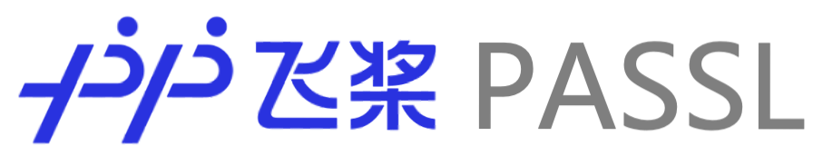

⚙️ 简体中文 | [English](./README.md)

<p align="center">
  
</p>
<p align="center">
    <a href="./LICENSE"></a>
    <a href=""></a>
    <a href="https://github.com/PaddlePaddle/PASSL/stargazers"></a>
    <a href=""></a>
  <a href="https://aistudio.baidu.com/aistudio/personalcenter/thirdview/940489"></a>
</p>

## 介绍

PASSL 是一个基于 PaddlePaddle 的视觉库，用于使用 PaddlePaddle 进行最先进的视觉自监督学习研究。PASSL旨在加速自监督学习的研究周期：**从设计一个新的自监督任务到评估所学的表征**。

PASSL 主要特性：

- 自监督前沿算法实现

  PASSL 实现了多种前沿自监督学习算法，包括不限于 [SimCLR](https://arxiv.org/abs/2002.05709)、[MoCo(v1)](https://arxiv.org/abs/1911.05722)、[MoCo(v2)](https://arxiv.org/abs/1911.05722)、[MoCo-BYOL](docs/Train_MoCo-BYOL_model.md)、[CLIP](https://arxiv.org/abs/2103.00020)、[BYOL](https://arxiv.org/abs/2006.07733)、[BEiT](https://arxiv.org/abs/2106.08254)。同时支持有监督分类训练。

- 模块化设计

  易于建立新的任务和重用其他任务的现有组件 (Trainer, models and heads, data transforms, etc.)

🛠️ PASSL 的最终目标是利用自监督学习为下游任务提供更合适的预训练权重，同时大幅度降低数据标注成本。

**📣 Recent Update:**

* (2022-2-9): 重构 README
* 🔥 Now：PASSL 目前正在进行框架重构

## 模型库

* **Self-Supervised Learning Models**

PASSL 实现了一系列自监督学习算法，更具体的使用文档请参阅 **Document**

|           | Epochs | Official results | PASSL results | Backbone  | Model                                                        | Document                                         |
| --------- | ------ | ---------------- | ------------- | --------- | ------------------------------------------------------------ | ------------------------------------------------ |
| MoCo      | 200    | 60.6             | 60.64         | ResNet-50 | [download](https://passl.bj.bcebos.com/models/moco_v1_r50_e200_ckpt.pdparams) | [Train MoCo](docs/Train_MoCo_model.md)           |
| SimCLR    | 100    | 64.5             | 65.3          | ResNet-50 | [download](https://passl.bj.bcebos.com/models/simclr_r50_ep100_ckpt.pdparams) | [Train SimCLR](docs/Train_SimCLR_model.md)       |
| MoCo v2   | 200    | 67.7             | 67.72         | ResNet-50 | [download](https://passl.bj.bcebos.com/models/moco_v2_r50_e200_ckpt.pdparams) | [Train MoCo](docs/Train_MoCo_model.md)           |
| MoCo-BYOL | 300    | 71.56            | 72.10         | ResNet-50 | [download](https://passl.bj.bcebos.com/models/mocobyol_r50_ep300_ckpt.pdparams) | [Train MoCo-BYOL](docs/Train_MoCo-BYOL_model.md) |
| BYOL      | 300    | 72.50            | 71.62         | ResNet-50 | [download](https://passl.bj.bcebos.com/models/byol_r50_300.pdparams) | [Train BYOL](docs/Train_BYOL_model.md)           |
| PixPro    | 100    | 55.1(fp16)       | 57.2(fp32)    | ResNet-50 | [download](https://passl.bj.bcebos.com/models/pixpro_r50_ep100_no_instance_with_linear.pdparams) | [Train PixPro](docs/Train_PixPro_model.md)       |
| DenseCL   | 200    | 63.62            | 64.61         | ResNet-50 | [download](https://drive.google.com/file/d/1RWPO_g-fNJv8FsmCZ3LUbPTgPwtx-ybZ/view?usp=sharing) | [Train PixPro](docs/Train_DenseCL_model.md)      |

> Benchmark Linear Image Classification on ImageNet-1K.

Comming Soon：更多的算法实现已经在我们的计划中 ... 

* **Classification Models**

PASSL 实现了视觉 Transformer 等具有影响力的图像分类算法，并提供了相应的预训练权重。旨在支持自监督、多模态、大模型算法的建设和研究。更多使用细节请参阅 [Classification_Models_Guide.md](docs/Classification_Models_Guide.md)

|                  | Detail                      | Tutorial                                                     |
| ---------------- | --------------------------- | ------------------------------------------------------------ |
| ViT              | /                           | [PaddleEdu](https://aistudio.baidu.com/aistudio/projectdetail/2293050) |
| Swin Transformer | /                           | [PaddleEdu](https://aistudio.baidu.com/aistudio/projectdetail/2280436) |
| CaiT             | [config](configs/cait)      | [PaddleFleet](https://aistudio.baidu.com/aistudio/projectdetail/3401469) |
| T2T-ViT          | [config](configs/t2t_vit)   | [PaddleFleet](https://aistudio.baidu.com/aistudio/projectdetail/3401348) |
| CvT              | [config](configs/cvt)       | [PaddleFleet](https://aistudio.baidu.com/aistudio/projectdetail/3401386) |
| BEiT             | [config](configs/beit)      | [unofficial](https://aistudio.baidu.com/aistudio/projectdetail/2417241) |
| MLP-Mixer        | [config](configs/mlp_mixer) | [PaddleFleet](https://aistudio.baidu.com/aistudio/projectdetail/3401295) |
| ConvNeXt         | [config](configs/convnext)  | [PaddleFleet](https://aistudio.baidu.com/aistudio/projectdetail/3407445) |

🔥 PASSL 提供了详细的算法剖析，具体请参阅 **Tutorial**。

## 安装

请参阅 [INSTALL.md](https://github.com/PaddlePaddle/PASSL/blob/main/docs/INSTALL.md) 进行安装

## 快速开始

请参阅 [GETTING_STARTED.md](https://github.com/PaddlePaddle/PASSL/blob/main/docs/GETTING_STARTED.md) 了解 PASSL 的基本用法

## Awesome SSL

自监督学习 (Self-Supervised Learning, SSL) 是一个发展十分迅速的领域，这里列出一些具有影响力的 Paper 供研究使用。PASSL 会争取实现具有应用潜力的自监督算法

* *[Masked Feature Prediction for Self-Supervised Visual Pre-Training](https://arxiv.org/abs/2112.09133)* by Chen Wei, Haoqi Fan, Saining Xie, Chao-Yuan Wu, Alan Yuille, Christoph Feichtenhofer.
* *[Masked Autoencoders Are Scalable Vision Learners](https://arxiv.org/abs/2111.06377)* by Kaiming He, Xinlei Chen, Saining Xie, Yanghao Li, Piotr Dollár, Ross Girshick.
* *[Corrupted Image Modeling for Self-Supervised Visual Pre-Training](https://arxiv.org/abs/2202.03382)* by Yuxin Fang, Li Dong, Hangbo Bao, Xinggang Wang, Furu Wei.
* *[Are Large-scale Datasets Necessary for Self-Supervised Pre-training?](https://arxiv.org/abs/2112.10740)* by Alaaeldin El-Nouby, Gautier Izacard, Hugo Touvron, Ivan Laptev, Hervé Jegou, Edouard Grave.
* *[PeCo: Perceptual Codebook for BERT Pre-training of Vision Transformers](https://arxiv.org/abs/2111.12710)* by Xiaoyi Dong, Jianmin Bao, Ting Zhang, Dongdong Chen, Weiming Zhang, Lu Yuan, Dong Chen, Fang Wen, Nenghai Yu.
* *[SimMIM: A Simple Framework for Masked Image Modeling](https://arxiv.org/abs/2111.09886)* by Zhenda Xie, Zheng Zhang, Yue Cao, Yutong Lin, Jianmin Bao, Zhuliang Yao, Qi Dai, Han Hu.

## 贡献

PASSL 还很年轻，它可能存在错误和问题。请在我们的错误跟踪系统中报告它们。我们欢迎您为 PASSL 做出贡献。此外，如果您对 PASSL 有任何想法，请告诉我们。

## 引用

如果 PASSL 对您的研究有帮助，欢迎引用

```
@misc{=passl,
    title={PASSL: A visual Self-Supervised Learning Library},
    author={PASSL Contributors},
    howpublished = {\url{https://github.com/PaddlePaddle/PASSL}},
    year={2022}
}
```

## 开源许可证

如 LICENSE.txt 文件中所示，PASSL 使用 Apache 2.0 版权协议。

