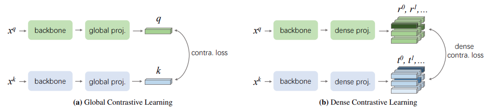

简体中文 | [English](README.md)

# Dense Contrastive Learning for Self-Supervised Visual Pre-Training ([arxiv](https://arxiv.org/abs/2011.09157))

## 简介

迄今为止，大多数现有的自我监督学习方法都是针对图像分类设计和优化的。由于图像级预测和像素级预测之间的差异，这些预训练模型对于密集预测任务可能不是最佳的。为了填补这一空白，我们的目标是设计一种有效的、密集的自监督学习方法，该方法通过考虑局部特征之间的对应关系，直接在像素（或局部特征）级别上进行对比学习。具体来说，我们提出了密集对比学习，它通过优化输入图像的两个视图之间的像素级别的成对对比（不）相似性损失来实现自我监督学习。与基线方法 MoCo-v2 相比，我们的方法引入的计算开销可以忽略不计（仅慢 <1%），但在转移到下游密集预测任务（包括对象检测、语义分割和实例分割）时表现出了一致的卓越性能，大大优于最先进的方法。具体来说，在强大的 MoCo-v2 基线上，我们的方法在 PASCAL VOC 对象检测上实现了 2.0% AP、COCO 对象检测上 1.1% AP、COCO 实例分割上 0.9% AP、PASCAL VOC 语义分割上 3.0% mIoU 和 3.0% mIoU 以及Cityscapes 语义分割 1.8% mIoU的显著改进。

<p align="center">
  
</p>


## 快速开始

### 1. 训练DenseCL

单卡训练

```bash
python tools/train.py -c configs/densecl/densecl_r50.yaml
```

多卡训练

```bash
python -m paddle.distributed.launch --gpus="0,1,2,3,4,5,6,7" tools/train.py -c configs/densecl/densecl_r50.yaml
```

200 个 epoch 的预训练模型权重：[densecl](https://drive.google.com/file/d/1RWPO_g-fNJv8FsmCZ3LUbPTgPwtx-ybZ/view?usp=sharing)

### 2. 提取 backbone 权重

```bash
python tools/extract_weight.py ${CHECKPOINT} --output ${WEIGHT_FILE} --remove_prefix
```

### 3. ImageNet 线性分类评估

训练

```bash
python -m paddle.distributed.launch --gpus="0,1,2,3,4,5,6,7" tools/train.py -c configs/moco/moco_clas_r50.yaml --pretrained ${WEIGHT_FILE}
```

评估

```bash
python -m paddle.distributed.launch --gpus="0,1,2,3,4,5,6,7" tools/train.py -c configs/moco/moco_clas_r50.yaml --load ${CLS_WEGHT_FILE} --evaluate-only
```

主干网络以及线性权重：[densecl linear](https://drive.google.com/file/d/1XJeDY8clKfhUeXw4JcCa1QgG2G-Ibr4m/view?usp=sharing)

### 参考

```
@inproceedings{wang2021dense,
  title={Dense contrastive learning for self-supervised visual pre-training},
  author={Wang, Xinlong and Zhang, Rufeng and Shen, Chunhua and Kong, Tao and Li, Lei},
  booktitle={Proceedings of the IEEE/CVF Conference on Computer Vision and Pattern Recognition},
  pages={3024--3033},
  year={2021}
}
```
