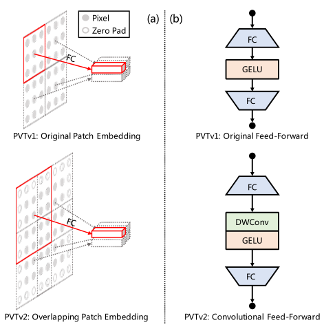

## PVTv2: Improved Baselines with Pyramid Vision Transformer([paperswithcode](https://paperswithcode.com/paper/pvtv2-improved-baselines-with-pyramid-vision))

## Introduction

Transformer recently has presented encouraging progress in computer vision. In this work, we present new baselines by improving the original Pyramid Vision Transformer (PVTv1) by adding three designs, including (1) linear complexity attention layer, (2) overlapping patch embedding, and (3) convolutional feed-forward network. With these modifications, PVTv2 reduces the computational complexity of PVTv1 to linear and achieves significant improvements on fundamental vision tasks such as classification, detection, and segmentation. Notably, the proposed PVTv2 achieves comparable or better performances than recent works such as Swin Transformer. We hope this work will facilitate state-of-the-art Transformer researches in computer vision. Code is available at https://github.com/whai362/PVT.  


## Getting Started

#### Train with single gpu
```bash
python tools/train.py -c configs/pvt_v2/${PVTv2_ARCH}.yaml
```
#### Train with multiple gpus

```bash
python -m paddle.distributed.launch --gpus="0,1,2,3,4,5,6,7" tools/train.py -c configs/pvt_v2/${PVTv2_ARCH}.yaml
```
#### Evaluate

```bash
python tools/train.py -c configs/pvt_v2/${PVTv2_ARCH}.yaml --load ${PVTv2_WEGHT_FILE} --evaluate-only
```


## Model Zoo

The results are evaluated on ImageNet2012 validation set

| Arch               | Weight                                                       | Top-1 Acc | Top-5 Acc | Crop ratio | # Params |
| ------------------ | ------------------------------------------------------------ | --------- | --------- | ---------- | -------- |
| pvt_v2_b0  | [pretrain 1k](https://passl.bj.bcebos.com/vision_transformers/pvt_v2/pvt_v2_b0.pdparams) | 70.47   | 90.16 | 1.0 | 3.67M |
| pvt_v2_b1  | [pretrain 1k](https://passl.bj.bcebos.com/vision_transformers/pvt_v2/pvt_v2_b1.pdparams) | 78.702   | 94.48 | 1.0 | 14.01M |
| pvt_v2_b2_linear  | [pretrain 1k](https://passl.bj.bcebos.com/vision_transformers/pvt_v2/pvt_v2_b2_linear.pdparams) | 82.06   | 95.04 | 1.0 | 22.55M |
| pvt_v2_b2  | [pretrain 1k](https://passl.bj.bcebos.com/vision_transformers/pvt_v2/pvt_v2_b2.pdparams) | 82.02   | 95.99 | 1.0 | 25.36M |
| pvt_v2_b3  | [pretrain 1k](https://passl.bj.bcebos.com/vision_transformers/pvt_v2/pvt_v2_b3.pdparams) | 83.14   | 96.47 | 1.0 | 45.24M |
| pvt_v2_b4  | [pretrain 1k](https://passl.bj.bcebos.com/vision_transformers/pvt_v2/pvt_v2_b4.pdparams) | 83.61   | 96.69 | 1.0 | 62.56M |
| pvt_v2_b5  | [pretrain 1k](https://passl.bj.bcebos.com/vision_transformers/pvt_v2/pvt_v2_b5.pdparams) | 83.77   | 96.61 | 1.0 | 81.96M |

## Usage

```python
import paddle.nn as nn
from passl.modeling.backbones import build_backbone
from passl.modeling.heads import build_head
from passl.utils.config import get_config


class Model(nn.Layer):
    def __init__(self, cfg_file):
        super().__init__()
        cfg = get_config(cfg_file)
        self.backbone = build_backbone(cfg.model.architecture)
        self.head = build_head(cfg.model.head)

    def forward(self, x):

        x = self.backbone(x)
        x = self.head(x)
        return x


cfg_file = "configs/pvt_v2/pvt_v2_b0.yaml"
m = Model(cfg_file)
```

## Reference

```
@article{wang2021pvtv2,
  title={Pvtv2: Improved baselines with pyramid vision transformer},
  author={Wang, Wenhai and Xie, Enze and Li, Xiang and Fan, Deng-Ping and Song, Kaitao and Liang, Ding and Lu, Tong and Luo, Ping and Shao, Ling},
  journal={Computational Visual Media},
  volume={8},
  number={3},
  pages={1--10},
  year={2022},
  publisher={Springer}
}
```
