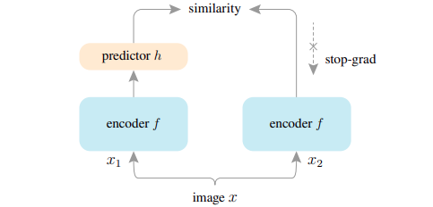

[简体中文](README_ch.md) | English

# Exploring Simple Siamese Representation Learning ([arxiv](https://arxiv.org/abs/2011.10566))

## Introduction

Siamese networks have become a common structure in various recent models for unsupervised visual representation learning. These models maximize the similarity between two augmentations of one image, subject to certain conditions for avoiding collapsing solutions. In this paper, we report surprising empirical results that simple Siamese networks can learn meaningful representations even using none of the following: (i) negative sample pairs, (ii) large batches, (iii) momentum encoders. Our experiments show that collapsing solutions do exist for the loss and structure, but a stop-gradient operation plays an essential role in preventing collapsing. We provide a hypothesis on the implication of stop-gradient, and further show proof-of-concept experiments verifying it. Our "SimSiam" method achieves competitive results on ImageNet and downstream tasks. We hope this simple baseline will motivate people to rethink the roles of Siamese architectures for unsupervised representation learning.

<p align="center">
  
</p>

## Getting Started

### 1. Train SimSiam

#### single gpu
```
python tools/train.py -c configs/simsiam/simsiam_r50.yaml
```

#### multiple gpus

```
python -m paddle.distributed.launch --gpus="0,1,2,3,4,5,6,7" tools/train.py -c configs/simsiam/simsiam_r50.yaml
```

Pretraining models with 100 epochs can be found at [simsiam](https://drive.google.com/file/d/1kaAm8-tlvB570kzI4fo9h4dwGQFf_4FE/view?usp=sharing)

Note: The default learning rate in config files is for 8 GPUs. If using differnt number GPUs, the total batch size will change in proportion, you have to scale the learning rate following ```new_lr = old_lr * new_ngpus / old_ngpus```.

### 2. Extract backbone weights

```
python tools/extract_weight.py ${CHECKPOINT} --output ${WEIGHT_FILE} --prefix encoder --remove_prefix
```

### 3. Evaluation on ImageNet Linear Classification

#### Train:
```
python -m paddle.distributed.launch --gpus="0,1,2,3,4,5,6,7" tools/train.py -c configs/simsiam/simsiam_clas_r50.yaml --pretrained ${WEIGHT_FILE}
```

#### Evaluate:
```
python -m paddle.distributed.launch --gpus="0,1,2,3,4,5,6,7" tools/train.py -c configs/simsiam/simsiam_clas_r50.yaml --load ${CLS_WEGHT_FILE} --evaluate-only
```

The trained linear weights in conjuction with the backbone weights can be found at [simsiam linear](https://drive.google.com/file/d/19smHZGhBEPWeyLjKIGhM7KPngr-8BOUl/view?usp=sharing)

## Reference

```
@inproceedings{chen2021exploring,
  title={Exploring simple siamese representation learning},
  author={Chen, Xinlei and He, Kaiming},
  booktitle={Proceedings of the IEEE/CVF Conference on Computer Vision and Pattern Recognition},
  pages={15750--15758},
  year={2021}
}
```
