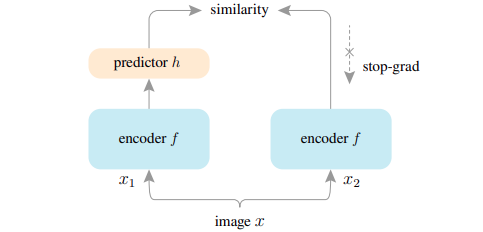

简体中文 | [English](README.md)

# Exploring Simple Siamese Representation Learning ([arxiv](https://arxiv.org/abs/2011.10566))

## 简介

孪生网络已成为最近各种无监督视觉表示学习模型中的常见结构。这些模型最大限度地提高了一幅图像的两个增强之间的相似性，受制于避免崩溃解决方案的某些条件。在本文中，我们报告了令人惊讶的经验结果，即简单的孪生网络即使不使用以下任何一种，也可以学习有意义的表示：（i）负样本对；（ii）大批量；（iii）动量编码器。我们的实验表明，对于损失和结构确实存在坍塌解决方案，但停止梯度操作在防止坍塌方面起着至关重要的作用。我们提供了关于停止梯度的含义的假设，并进一步展示了验证它的概念验证实验。我们的SimSiam方法在 ImageNet 和下游任务上取得了有竞争力的结果。我们希望这个简单的基线能够激发人们重新思考孪生架构在无监督表示学习中的作用。

<p align="center">
  
</p>


## 快速开始

### 1. 训练SimSiam

单卡训练

```bash
python tools/train.py -c configs/simsiam/simsiam_r50.yaml
```

多卡训练

```bash
python -m paddle.distributed.launch --gpus="0,1,2,3,4,5,6,7" tools/train.py -c configs/simsiam/simsiam_r50.yaml
```

100 个 epoch 的预训练模型权重： [simsiam](https://drive.google.com/file/d/1kaAm8-tlvB570kzI4fo9h4dwGQFf_4FE/view?usp=sharing)

### 2. 提取 backbone 权重

```bash
python tools/extract_weight.py ${CHECKPOINT} --output ${WEIGHT_FILE} --prefix encoder --remove_prefix
```

### 3. ImageNet 线性分类评估

训练

```bash
python -m paddle.distributed.launch --gpus="0,1,2,3,4,5,6,7" tools/train.py -c configs/simsiam/simsiam_clas_r50.yaml --pretrained ${WEIGHT_FILE}
```

评估

```bash
python -m paddle.distributed.launch --gpus="0,1,2,3,4,5,6,7" tools/train.py -c configs/simsiam/simsiam_clas_r50.yaml --load ${CLS_WEGHT_FILE} --evaluate-only
```

主干网络以及线性权重：[simsiam linear](https://drive.google.com/file/d/19smHZGhBEPWeyLjKIGhM7KPngr-8BOUl/view?usp=sharing)

### 参考

```
@inproceedings{chen2021exploring,
  title={Exploring simple siamese representation learning},
  author={Chen, Xinlei and He, Kaiming},
  booktitle={Proceedings of the IEEE/CVF Conference on Computer Vision and Pattern Recognition},
  pages={15750--15758},
  year={2021}
}
```
