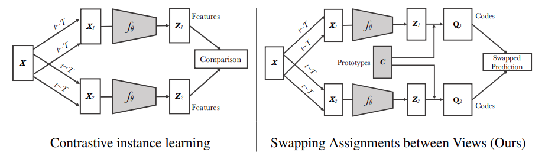

[简体中文](README_ch.md) | English

# Unsupervised Learning of Visual Features by Contrasting Cluster Assignments ([arxiv](https://arxiv.org/abs/2006.09882))

## Introduction

Unsupervised image representations have significantly reduced the gap with supervised pretraining, notably with the recent achievements of contrastive learning methods. These contrastive methods typically work online and rely on a large number of explicit pairwise feature comparisons, which is computationally challenging. In this paper, we propose an online algorithm, SwAV, that takes advantage of contrastive methods without requiring to compute pairwise comparisons. Specifically, our method simultaneously clusters the data while enforcing consistency between cluster assignments produced for different augmentations (or views) of the same image, instead of comparing features directly as in contrastive learning. Simply put, we use a swapped prediction mechanism where we predict the cluster assignment of a view from the representation of another view. Our method can be trained with large and small batches and can scale to unlimited amounts of data. Compared to previous contrastive methods, our method is more memory efficient since it does not require a large memory bank or a special momentum network. In addition, we also propose a new data augmentation strategy, multi-crop, that uses a mix of views with different resolutions in place of two full-resolution views, without increasing the memory or compute requirements much. We validate our findings by achieving 75.3% top-1 accuracy on ImageNet with ResNet-50, as well as surpassing supervised pretraining on all the considered transfer tasks.

<p align="center">
  
</p>


## Getting Started

### 1. Train DenseCL

#### single gpu
```
python tools/train.py -c configs/swav/swav_r50_100ep.yaml
```

#### multiple gpus

```
python -m paddle.distributed.launch --gpus="0,1,2,3,4,5,6,7" tools/train.py -c configs/swav/swav_r50_100ep.yaml
```

Pretraining models with 100 epochs can be found at [swav](https://drive.google.com/file/d/1budFSoQqZz1Idyej-R4E6kUnL8CGtdyu/view?usp=sharing)

Note: The default learning rate in config files is for 8 GPUs. If using differnt number GPUs, the total batch size will change in proportion, you have to scale the learning rate following ```new_lr = old_lr * new_ngpus / old_ngpus```.

### 2. Extract backbone weights

```
python tools/extract_weight.py ${CHECKPOINT} --output ${WEIGHT_FILE} --remove_prefix
```

### 3. Evaluation on ImageNet Linear Classification

#### Train:
```
python -m paddle.distributed.launch --gpus="0,1,2,3,4,5,6,7" tools/train.py -c configs/swav/swav_clas_r50.yaml --pretrained ${WEIGHT_FILE}
```

#### Evaluate:
```
python -m paddle.distributed.launch --gpus="0,1,2,3,4,5,6,7" tools/train.py -c configs/swav/swav_clas_r50.yaml --load ${CLS_WEGHT_FILE} --evaluate-only
```

The trained linear weights in conjuction with the backbone weights can be found at [swav linear](https://drive.google.com/file/d/1uduDAqJqK1uFclhQSK0d9RjzGNYR_Tj2/view?usp=sharing)

## Reference

```
@inproceedings{caron2020unsupervised,
  title={Unsupervised learning of visual features by contrasting cluster assignments},
  author={Caron, Mathilde and Misra, Ishan and Mairal, Julien and Goyal, Priya and Bojanowski, Piotr and Joulin, Armand},
  journal={Advances in Neural Information Processing Systems},
  volume={33},
  pages={9912--9924},
  year={2020}
}
```
