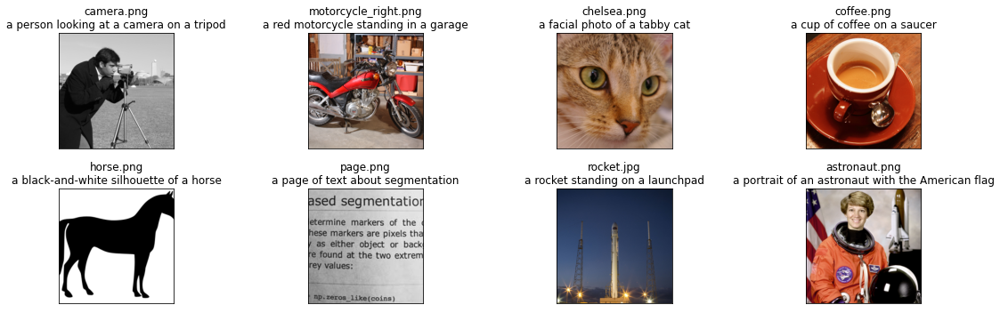
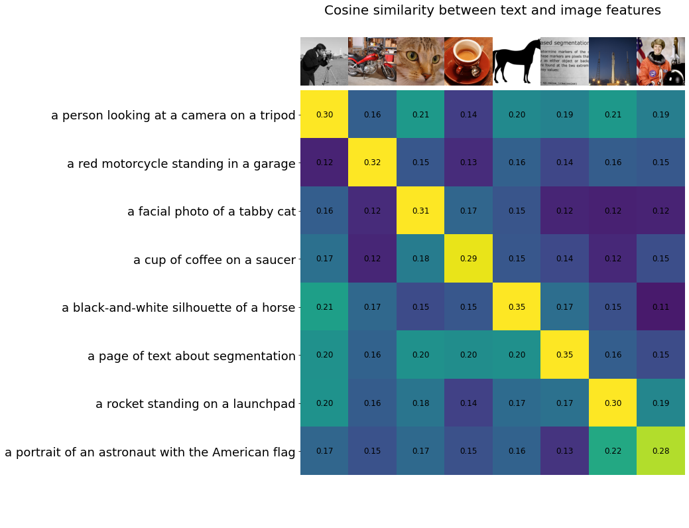

# Train CLIP Model

## Introduction

PASSL reproduces openai [CLIP](https://arxiv.org/abs/2103.00020), which learns transferable visual conceptions from natual language supervision. CLIP can be applied to any visual classification benchmark by simply providing the names of the visual categories to be recognized, similar to the “zero-shot” capabilities of GPT-2 and GPT-3[<sup>1</sup>](#refer-anchor-1).
## Installation
- See [INSTALL.md](INSTALL.md)

## Data Preparation
- See [GETTING_STARTED.md](GETTING_STARTED.md)


## Getting Started

### 1. Train CLIP on FOOD101

#### single gpu
```
python tools/train.py -c configs/clip/vit-b-32.yaml
```

#### multiple gpus

```
python tools/train.py -c configs/clip/vit-b-32.yaml --num-gpus 8
```

Note: The default learning rate in config files is for 8 GPUs. If using differnt number GPUs, the total batch size will change in proportion, you have to scale the learning rate following ```new_lr = old_lr * new_ngpus / old_ngpus```.

### 2. Fine-tune CLIP on FOOD101
Pretraining openai model can be found at [ViT-B-32.pdparams](https://passl.bj.bcebos.com/models/ViT-B-32.pdparams)
```

python tools/train.py -c configs/clip/vit-b-32.yaml --num-gpus 8 --load ViT-B-32.pdparams
```


### 3. Interacting with CLIP

This is a self-contained notebook that shows how to download and run CLIP models, calculate the similarity between arbitrary image and text inputs, and perform zero-shot image classifications.
```
!python3 -m pip install paddlepaddle-gpu -i https://mirror.baidu.com/pypi/simple
import numpy as np
import paddle 

print("Paddle version:", paddle.__version__)
```
Paddle version: 2.1.1
### Downloading the model

```
!wget https://passl.bj.bcebos.com/models/ViT-B-32.pdparams

# Load Model
from passl.modeling.architectures import CLIPWrapper
arch = {'name': 'CLIP', 'embed_dim':512, 
        'image_resolution': 224, 'vision_layers': 12,
        'vision_width': 768, 'vision_patch_size': 32,
        'context_length': 77, 'vocab_size': 49408,
        'transformer_width': 512, 'transformer_heads': 8,
        'transformer_layers': 12,'qkv_bias': True}
head = {'name': 'ClipCNHead'}
model = CLIPWrapper(architectual=arch, head=head)
```
### Image Preprocessing

We resize the input images and center-crop them to conform with the image resolution that the model expects. Before doing so, we will normalize the pixel intensity using the dataset mean and standard deviation.
```
# Data Preprocessing
from paddle.vision.transforms import Compose, Resize, CenterCrop, ToTensor, Normalize
from passl.datasets.preprocess.transforms import ToRGB

preprocess = Compose([Resize(224,interpolation='bicubic'),
                     CenterCrop(224),
                     ToTensor(),
                     ])
image_mean = paddle.to_tensor([0.48145466, 0.4578275, 0.40821073])
image_std = paddle.to_tensor([0.26862954, 0.26130258, 0.27577711])
```
### Text Preprocessing

We use a case-insensitive tokenizer. The tokenizer code is hidden in the second cell below
```
import gzip
import html
import os
from functools import lru_cache

import ftfy
import regex as re


@lru_cache()
def bytes_to_unicode():
    """
    Returns list of utf-8 byte and a corresponding list of unicode strings.
    The reversible bpe codes work on unicode strings.
    This means you need a large # of unicode characters in your vocab if you want to avoid UNKs.
    When you're at something like a 10B token dataset you end up needing around 5K for decent coverage.
    This is a signficant percentage of your normal, say, 32K bpe vocab.
    To avoid that, we want lookup tables between utf-8 bytes and unicode strings.
    And avoids mapping to whitespace/control characters the bpe code barfs on.
    """
    bs = list(range(ord("!"), ord("~")+1))+list(range(ord("¡"), ord("¬")+1))+list(range(ord("®"), ord("ÿ")+1))
    cs = bs[:]
    n = 0
    for b in range(2**8):
        if b not in bs:
            bs.append(b)
            cs.append(2**8+n)
            n += 1
    cs = [chr(n) for n in cs]
    return dict(zip(bs, cs))


def get_pairs(word):
    """Return set of symbol pairs in a word.
    Word is represented as tuple of symbols (symbols being variable-length strings).
    """
    pairs = set()
    prev_char = word[0]
    for char in word[1:]:
        pairs.add((prev_char, char))
        prev_char = char
    return pairs


def basic_clean(text):
    text = ftfy.fix_text(text)
    text = html.unescape(html.unescape(text))
    return text.strip()


def whitespace_clean(text):
    text = re.sub(r'\s+', ' ', text)
    text = text.strip()
    return text


class SimpleTokenizer(object):
    def __init__(self, bpe_path: str = "passl/utils/bpe_simple_vocab_16e6.txt.gz"):
        self.byte_encoder = bytes_to_unicode()
        self.byte_decoder = {v: k for k, v in self.byte_encoder.items()}
        merges = gzip.open(bpe_path).read().decode("utf-8").split('\n')
        merges = merges[1:49152-256-2+1]
        merges = [tuple(merge.split()) for merge in merges]
        vocab = list(bytes_to_unicode().values())
        vocab = vocab + [v+'</w>' for v in vocab]
        for merge in merges:
            vocab.append(''.join(merge))
        vocab.extend(['<|startoftext|>', '<|endoftext|>'])
        self.encoder = dict(zip(vocab, range(len(vocab))))
        self.decoder = {v: k for k, v in self.encoder.items()}
        self.bpe_ranks = dict(zip(merges, range(len(merges))))
        self.cache = {'<|startoftext|>': '<|startoftext|>', '<|endoftext|>': '<|endoftext|>'}
        self.pat = re.compile(r"""<\|startoftext\|>|<\|endoftext\|>|'s|'t|'re|'ve|'m|'ll|'d|[\p{L}]+|[\p{N}]|[^\s\p{L}\p{N}]+""", re.IGNORECASE)

    def bpe(self, token):
        if token in self.cache:
            return self.cache[token]
        word = tuple(token[:-1]) + ( token[-1] + '</w>',)
        pairs = get_pairs(word)

        if not pairs:
            return token+'</w>'

        while True:
            bigram = min(pairs, key = lambda pair: self.bpe_ranks.get(pair, float('inf')))
            if bigram not in self.bpe_ranks:
                break
            first, second = bigram
            new_word = []
            i = 0
            while i < len(word):
                try:
                    j = word.index(first, i)
                    new_word.extend(word[i:j])
                    i = j
                except:
                    new_word.extend(word[i:])
                    break

                if word[i] == first and i < len(word)-1 and word[i+1] == second:
                    new_word.append(first+second)
                    i += 2
                else:
                    new_word.append(word[i])
                    i += 1
            new_word = tuple(new_word)
            word = new_word
            if len(word) == 1:
                break
            else:
                pairs = get_pairs(word)
        word = ' '.join(word)
        self.cache[token] = word
        return word

    def encode(self, text):
        bpe_tokens = []
        text = whitespace_clean(basic_clean(text)).lower()
        for token in re.findall(self.pat, text):
            token = ''.join(self.byte_encoder[b] for b in token.encode('utf-8'))
            bpe_tokens.extend(self.encoder[bpe_token] for bpe_token in self.bpe(token).split(' '))
        return bpe_tokens

    def decode(self, tokens):
        text = ''.join([self.decoder[token] for token in tokens])
        text = bytearray([self.byte_decoder[c] for c in text]).decode('utf-8', errors="replace").replace('</w>', ' ')
        return text
```
### Setting up input images and texts

We are going to feed 8 example images and their textual descriptions to the model, and compare the similarity between the corresponding features.

The tokenizer is case-insensitive, and we can freely give any suitable textual descriptions.
```
import os
import skimage

import matplotlib.pyplot as plt
from PIL import Image

from collections import OrderedDict


# images in skimage to use and their textual descriptions
descriptions = {
    "page": "a page of text about segmentation",
    "chelsea": "a facial photo of a tabby cat",
    "astronaut": "a portrait of an astronaut with the American flag",
    "rocket": "a rocket standing on a launchpad",
    "motorcycle_right": "a red motorcycle standing in a garage",
    "camera": "a person looking at a camera on a tripod",
    "horse": "a black-and-white silhouette of a horse", 
    "coffee": "a cup of coffee on a saucer"
}

images = []
texts = []
plt.figure(figsize=(16, 5))

for filename in [filename for filename in os.listdir(skimage.data_dir) if filename.endswith(".png") or filename.endswith(".jpg")]:
    name = os.path.splitext(filename)[0]
    if name not in descriptions:
        continue

    im = Image.open(os.path.join(skimage.data_dir, filename))
    image = preprocess(im.convert("RGB"))
    images.append(image)
    texts.append(descriptions[name])

    plt.subplot(2, 4, len(images))
    plt.imshow(image.transpose((1, 2, 0)))
    plt.title(f"{filename}\n{descriptions[name]}")
    plt.xticks([])
    plt.yticks([])

plt.tight_layout()
```


### Building features

We normalize the images, tokenize each text input, and run the forward pass of the model to get the image and text features.
```
image_input = paddle.to_tensor(np.stack(images))
image_input -= paddle.to_tensor(np.array(image_mean).reshape(-1,1,1))
image_input /= paddle.to_tensor(np.array(image_std).reshape(-1,1,1))

tokenizer = SimpleTokenizer()
text_tokens = [tokenizer.encode("This is " + desc) for desc in texts]

text_input = paddle.zeros((len(text_tokens), 77), dtype="int64")
sot_token = tokenizer.encoder['<|startoftext|>']
eot_token = tokenizer.encoder['<|endoftext|>']

for i, tokens in enumerate(text_tokens):
    tokens = [sot_token] + tokens + [eot_token]
    text_input[i, :len(tokens)] = paddle.to_tensor(tokens)

with paddle.no_grad():
    import numpy as np
    image_input = paddle.to_tensor(np.load('image_input.npy'))
    text_input = paddle.to_tensor(np.load('text_input.npy'))
    state_dict = paddle.load("pretrain/ViT-B-32.pdparams")['state_dict']
    model.set_state_dict(state_dict)
    image_features = model.model.encode_image(image_input)
    text_features = model.model.encode_text(text_input)
```
### Calculating cosine similarity
We normalize the features and calculate the dot product of each pair.
```
image_features /= image_features.norm(axis=-1, keepdim=True)
text_features /= text_features.norm(axis=-1, keepdim=True)
similarity = paddle.matmul(text_features, image_features.t()).cpu().numpy()

count = len(descriptions)
plt.figure(figsize=(20, 14))
plt.imshow(similarity, vmin=0.1, vmax=0.3)
# plt.colorbar()
plt.yticks(range(count), texts, fontsize=18)
plt.xticks([])
for i, image in enumerate(images):
    plt.imshow(image.transpose((1, 2, 0)), extent=(i - 0.5, i + 0.5, -1.6, -0.6), origin="lower")
for x in range(similarity.shape[1]):
    for y in range(similarity.shape[0]):
        plt.text(x, y, f"{similarity[y, x]:.2f}", ha="center", va="center", size=12)

for side in ["left", "top", "right", "bottom"]:
  plt.gca().spines[side].set_visible(False)

plt.xlim([-0.5, count - 0.5])
plt.ylim([count + 0.5, -2])

plt.title("Cosine similarity between text and image features", size=20)
```
Text(0.5, 1.0, 'Cosine similarity between text and image features')



## Reference
<div id="refer-anchor-1"></div>
- [1] [CLIP: Connecting Text and Images](https://openai.com/blog/clip/)
