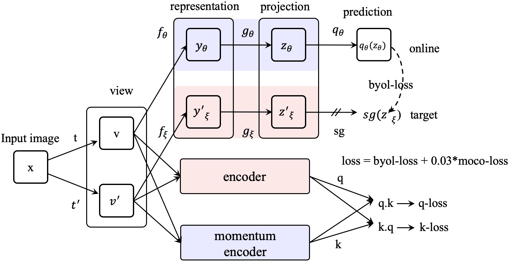

# Train MoCoBYOL Model

## Introduction

PASSL implements MoCoBYOL, a way of connecting [MoCo](https://arxiv.org/abs/1911.05722) and [BYOL](https://arxiv.org/abs/2006.07733) for **self-supervised learning** with a multiple loss.

## Installation
- See [INSTALL.md](INSTALL.md)

## Data Preparation
- See [GETTING_STARTED.md](GETTING_STARTED.md)

## Implemented Models
|  | epochs |official results | passl results | Backbone| Model |
| ---|--- | ----  | ---- | ----| ---- |
| MoCo-BYOL | 300 | 71.56 | 72.10| ResNet-50 | [download](https://passl.bj.bcebos.com/models/mocobyol_r50_clas.pdparams)|

## Getting Started

### 1. Train MoCoBYOL

#### single gpu
```
python tools/train.py -c configs/moco_byol/moco_byol_r50_IM.yaml
```

#### multiple gpus

```
python -m paddle.distributed.launch --gpus="0,1,2,3,4,5,6,7" tools/train.py -c configs/moco_byol/moco_byol_r50_IM.yaml
```

Pretraining models with 300 epochs can be found at [mocobyol_r50_ep300_ckpt.pdparams](https://passl.bj.bcebos.com/models/mocobyol_r50_ep300_ckpt.pdparams)

Note: The default learning rate in config files is for 8 GPUs. If using differnt number GPUs, the total batch size will change in proportion, you have to scale the learning rate following ```new_lr = old_lr * new_ngpus / old_ngpus```.

### 2. Extract backbone weights

```
python tools/extract_weight.py  mocobyol_r50_ep300_ckpt.pdparams --output ${WEIGHT_FILE}
```

### 3. Evaluation on ImageNet Linear Classification

#### Train:
```
python -m paddle.distributed.launch --gpus="0,1,2,3,4,5,6,7" tools/train.py -c configs/moco_byol/moco_byol_50_IM_clas.yaml --pretrained ${WEIGHT_FILE}
```

#### Evaluate:
```
python -m paddle.distributed.launch --gpus="0,1,2,3,4,5,6,7" tools/train.py -c configs/moco_byol/moco_byol_r50_IM_clas.yaml --load ${CLS_WEGHT_FILE} --evaluate-only
```

The trained linear weights in conjuction with the backbone weights can be found at [MoCoBYOL](https://passl.bj.bcebos.com/models/mocobyol_r50_clas.pdparams)